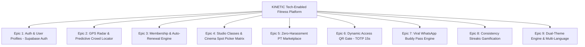

# Product Requirements Document (PRD) — KINETIC Tech-Enabled Fitness Platform

---

## 1. Executive Summary & Visi Produk

### 1.1 Visi Produk
Membangun ekosistem platform kebugaran digital generasi baru (**KINETIC**) berbasis **Full-Stack TypeScript & Supabase** yang mengungguli gym konvensional di Indonesia melalui inovasi terintegrasi:
1. 🔮 **Predictive Crowd Forecast AI**: Prediksi jam terbaik latihan per cabang untuk bebas antre alat dengan integrasi rute Google Maps & Waze.
2. 💺 **Cinema-Style Studio Spot Picker**: Pilih posisi matras studio spesifik (Row A/B/C) saat booking kelas, dilengkapi integrasi Google Calendar & file `.ics`.
3. 🎟️ **Viral WhatsApp Buddy Pass**: Ajak teman 1-klik via WhatsApp dengan tiket 1-day pass instan.
4. 🔥 **Consistency Streaks & Burn-to-Earn**: Gamifikasi reward diskon renewal bagi member yang konsisten berlatih.
5. 🛡️ **Zero-Harassment PT Marketplace**: Pemesanan trainer 100% transparan dengan target fisik, bukti transformasi, dan konsultasi WhatsApp langsung.
6. 🌓 **Titanium Lab Dual-Theme Engine**: Transisi mulus antara Obsidian Dark Mode dan Titanium Lab Light Mode.
7. 🌐 **International Multi-Language System**: Dukungan penuh dwibahasa (Bahasa Indonesia & English).

---

## 2. Target Pengguna & Persona

| Persona | Profil & Karakteristik | Kebutuhan Utama | Nilai Tambah KINETIC |
| :--- | :--- | :--- | :--- |
| **Budi (The Busy Professional)** | Usia 26-35 thn, pekerja kantoran SCBD/Kuningan. | Gym dekat kantor, tahu jam sepi agar tidak buang waktu. | **Predictive Crowd Forecast** & **GPS Radar** merekomendasikan cabang terdekat dan jam lengang terbaik. |
| **Siti (The Class Enthusiast)** | Usia 22-32 thn, gemar BodyPump, Yoga, & Cycling. | Kepastian posisi sepeda/matras favorit di studio. | **Cinema Studio Spot Picker** memungkinkan pilih spot depan / dekat instruktur tanpa berebut. |
| **Dimas (The Social Gymmer)** | Usia 20-30 thn, suka mengajak teman kantor/kampus. | Ajak teman tanpa birokrasi form kertas resepsionis. | **WhatsApp Buddy Pass** mengirim tiket QR 1-Day langsung via WhatsApp. |
| **Reza (The Serious Lifter)** | Usia 22-40 thn, ingin bimbingan pelatih tanpa paksaan. | Pelatih kredibel, review transparan, bebas paksaan sales. | **PT Marketplace** dengan rating terverifikasi & tarif per sesi terbuka. |

---

## 3. Fitur Utama & Struktur Epics

---

## 4. Rincian Fitur & User Stories

### Epic 2: GPS Radar & Predictive Crowd Forecast (USP 1)
- **US-2.1**: Sebagai member, saya ingin mendeteksi cabang terdekat dalam radius GPS posisi saya saat ini.
- **US-2.2**: Sebagai member, saya ingin melihat grafik estimasi kepadatan per jam pada cabang gym agar bisa berolahraga di jam paling lengang.
- **US-2.3**: Sebagai member, saya bisa membuka rute navigasi instan ke cabang tujuan via Google Maps atau Waze.

### Epic 4: Cinema-Style Studio Spot Picker (USP 2)
- **US-4.1**: Sebagai member, saat booking kelas studio, saya ingin melihat denah visual interaktif dan memilih nomor matras/kursi spesifik (Row A, B, C).
- **US-4.2**: Sebagai member, setelah booking berhasil, saya dapat menambahkan jadwal latihan ke Google Calendar atau mengunduh file `.ics` untuk kalender ponsel.

### Epic 6: Dynamic 15-Second QR Turnstile Pass
- **US-6.1**: Sebagai member aktif, saya memiliki Dynamic QR Pass di ponsel yang melakukan regenerasi token setiap 15 detik untuk mencegah kecurangan *pass sharing*.
- **US-6.2**: Sebagai sistem gerbang (*turnstile*), verifikasi token terjadi dalam waktu < 200 ms.

### Epic 9: Dual-Theme Engine & Multi-Language
- **US-9.1**: Sebagai member, saya dapat mengganti tampilan website antara tema gelap (*Obsidian*) dan tema terang (*Titanium Lab*) dengan satu klik.
- **US-9.2**: Sebagai member internasional, saya dapat mengganti bahasa antarmuka antara Bahasa Indonesia (ID) dan English (EN).

---

## 5. Spesifikasi Teknis & Non-Functional Requirements

- **Frontend**: Next.js 15 (React 19, TypeScript, Tailwind CSS, Framer Motion)
- **Backend & Database**: Next.js Route Handlers + Supabase PostgreSQL 16
- **Keamanan Data**: Row Level Security (RLS) di seluruh tabel skema publik
- **Performa Verifikasi QR**: < 200 ms dari scan hingga gerbang terbuka
- **Responsivitas**: 100% Mobile-First Touch Target (>44px touch targets)
