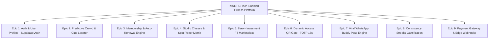

# Product Requirements Document (PRD) — KINETIC Tech-Enabled Fitness Platform

---

## 1. Executive Summary & Visi Produk

### 1.1 Visi Produk
Membangun ekosistem platform kebugaran digital generasi baru (**KINETIC**) berbasis **Full-Stack TypeScript & Supabase** yang mengungguli gym konvensional dan FitHub di Indonesia melalui 5 fitur pembeda unik:
1. 🔮 **Predictive Crowd Forecast**: Prediksi jam terbaik latihan per cabang untuk bebas antre alat.
2. 💺 **Interactive Studio Spot Picker**: Pilih posisi matras/sepeda bioskop-style saat booking kelas.
3. 🎟️ **Viral WhatsApp Buddy Pass**: Ajak teman 1-klik via WhatsApp dengan tiket 1-day pass instan.
4. 🔥 **Consistency Streaks & Burn-to-Earn**: Gamifikasi reward diskon renewal hingga 15% bagi member yang konsisten.
5. 🛡️ **Zero-Harassment PT Marketplace**: Pemesanan trainer 100% transparan dengan video intro & ulasan terverifikasi (tanpa rayuan sales di gym floor).

---

## 2. Target Pengguna & Persona

| Persona | Profil & Karakteristik | Kebutuhan Utama | Nilai Tambah KINETIC |
| :--- | :--- | :--- | :--- |
| **Budi (The Busy Professional)** | Usia 26-35 thn, pekerja kantoran SCBD/Kuningan. | Gym dekat kantor, tahu jam sepi agar tidak buang waktu. | **Predictive Crowd Forecast** merekomendasikan jam lengang terbaik (14:00 - 16:00). |
| **Siti (The Class Enthusiast)** | Usia 22-32 thn, gemar BodyPump, Yoga, & Spinning. | Kepastian posisi sepeda/matras favorit di studio. | **Studio Spot Picker** memungkinkan pilih spot depan / dekat AC tanpa berebut. |
| **Dimas (The Social Gymmer)** | Usia 20-30 thn, suka mengajak teman kantor/kampus. | Ajak teman tanpa birokrasi form kertas resepsionis. | **WhatsApp Buddy Pass** mengirim tiket QR 1-Day langsung via WA. |
| **Reza (The Serious Lifter)** | Usia 22-40 thn, ingin bimbingan pelatih tanpa paksaan. | Pelatih kredibel, review transparan, bebas paksaan sales. | **PT Marketplace** dengan rating terverifikasi & tarif per sesi terbuka. |

---

## 3. Fitur Utama & Struktur Epics

---

## 4. Rincian Fitur & User Stories

### Epic 2: Predictive Crowd Forecast (USP 1)
- **US-2.1**: Sebagai member, saya ingin melihat grafik estimasi kepadatan per jam pada cabang gym agar saya bisa merencanakan waktu latihan di jam paling lengang.
- **US-2.2**: Sebagai sistem, algoritma menghitung rata-rata okupansi mingguan dan menandai `is_best_time = TRUE` pada jam-jam dengan kepadatan < 35%.

### Epic 4: Interactive Studio Spot Picker (USP 2)
- **US-4.1**: Sebagai member, saat booking kelas BodyPump/Spinning, saya ingin melihat denah studio dan memilih nomor matras/sepeda spesifik.
- **US-4.2**: Sebagai sistem, penguncian spot menggunakan PostgreSQL RPC `book_class_atomic` dengan constraint `UNIQUE(schedule_id, seat_number)` untuk menjamin tidak ada kursi ganda.

### Epic 7: Viral WhatsApp Buddy Pass (USP 3)
- **US-7.1**: Sebagai member paket Pro/Elite, saya ingin mengirimkan 1-Day Pass gratis ke teman saya via link WhatsApp sekali klik.
- **US-7.2**: Sebagai teman (guest), saat mengklik link WhatsApp, saya langsung mendapatkan Dynamic QR Pass yang aktif hari ini tanpa perlu mendaftar membership berbayar.

### Epic 8: Consistency Streaks Gamification (USP 4)
- **US-8.1**: Sebagai member, setiap kali saya check-in minimal 3x seminggu, streak mingguan saya bertambah (+1 Week Streak).
- **US-8.2**: Sebagai member, jika mencapai 12 minggu streak berturut-turut, sistem otomatis memberikan kupon diskon 15% untuk perpanjangan paket berikutnya.

### Epic 5: Zero-Harassment PT Marketplace (USP 5)
- **US-5.1**: Sebagai member, saya dapat menonton video intro singkat pelatih, melihat sertifikasi, dan membaca ulasan asli dari member yang telah menyelesaikan minimal 12 sesi.
- **US-5.2**: Sebagai pelatih, saya menerima booking dan notifikasi jadwal sesi langsung dari aplikasi tanpa perlu melakukan *cold prospecting* di area gym.

---

## 5. Spesifikasi Teknis & Non-Functional Requirements

- **Frontend**: Next.js 15 (React 19, TypeScript, Tailwind CSS, App Router)
- **Backend Engine**: Next.js Route Handlers + Supabase PostgreSQL 16
- **Realtime**: Supabase Realtime Channels (WebSockets)
- **IoT Turnstile Controller**: Node.js + TypeScript daemon di Raspberry Pi
- **Keamanan Data**: Row Level Security (RLS) di 100% tabel skema publik
- **Performa Verifikasi QR**: < 200 ms dari scan hingga gerbang terbuka.
