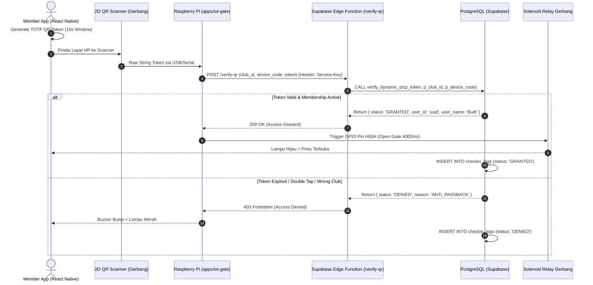
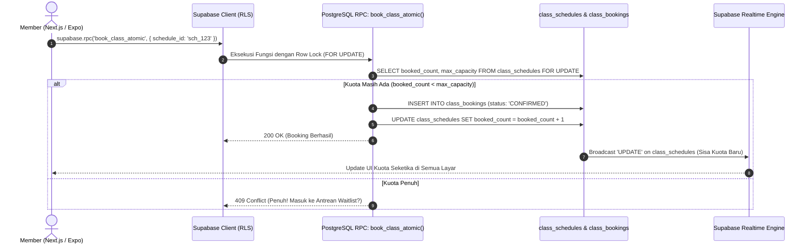
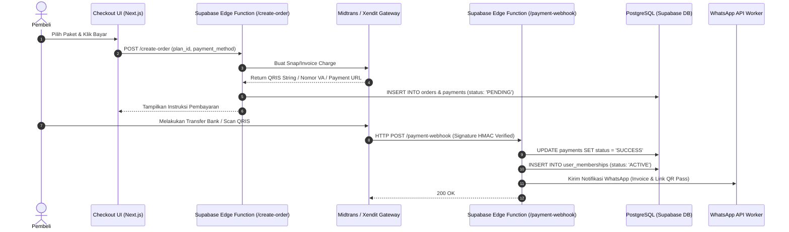

# System Architecture & Technical Specification — Full-Stack TypeScript & Supabase

---

## 1. System Overview & Arsitektur Monorepo

Platform dirancang menggunakan arsitektur **Full-Stack TypeScript Monorepo (Turborepo)** dengan **Supabase** sebagai fondasi *Backend-as-a-Service (BaaS)* dan *Database Engine*. Arsitektur ini memaksimalkan kecepatan rilis, konsistensi tipe data (*End-to-End Type Safety*), dan keamanan multi-cabang dengan *Row Level Security (RLS)*.

```mermaid
graph TB
    subgraph Client Layer [Full TypeScript Client Layer]
        Web[apps/web: Next.js 15 App Router - Public & Member PWA]
        Mobile[apps/mobile: React Native Expo - Member iOS & Android]
        Admin[apps/admin: Next.js 15 - Staff POS & Branch Manager]
    end

    subgraph Shared TypeScript Packages [Turborepo Workspace]
        Types["@kinetic/types (Database & DTO Types)"]
        Validators["@kinetic/validators (Zod Schemas)"]
        UI["@kinetic/ui (Shared Component Tokens)"]
    end

    subgraph Supabase Ecosystem [Cloud Backend & Data Platform]
        SupabaseAuth[Supabase Auth - WhatsApp OTP / OAuth / JWT]
        RLS[PostgreSQL 16 Engine + Row Level Security - RLS]
        Realtime[Supabase Realtime - WebSocket Engine]
        Storage[Supabase Storage - S3 Media & Invoices]
        EdgeFunctions[Supabase Edge Functions - Deno/TypeScript]
        RPC[PostgreSQL Stored Procedures - Atomic Booking]
    end

    subgraph IoT & Edge Infrastructure
        EdgeGateway[apps/iot-gate: Node.js TS di Raspberry Pi 4]
        Turnstile[Turnstile Gate Relay & 2D QR Barcode Scanner]
    end

    subgraph External Payment & Messaging
        PG[Payment Gateway - Midtrans / Xendit]
        WAGateway[WhatsApp Business API - Notification Service]
    end

    Client Layer -.-> Shared TypeScript Packages
    EdgeGateway -.-> Shared TypeScript Packages

    Web & Mobile & Admin -->|Supabase JS Client + RLS| RLS
    Web & Mobile & Admin -->|Auth SDK| SupabaseAuth
    Web & Mobile & Admin -->|WebSocket Subscriptions| Realtime
    Web & Mobile -->|File Uploads| Storage

    EdgeFunctions --> PG
    EdgeFunctions --> WAGateway
    PG -->|Webhook HTTP POST| EdgeFunctions
    EdgeFunctions -->|Service Role Client| RLS

    EdgeGateway <== Realtime WebSocket / REST ==> EdgeFunctions
    EdgeGateway --> Turnstile
```

---

## 2. Pilihan Tech Stack Lengkap (Full-Stack TypeScript)

| Komponen | Teknologi | Peran & Alasan Pemilihan |
| :--- | :--- | :--- |
| **Monorepo Manager** | **Turborepo + pnpm** | Mengelola multi-aplikasi (Web, Mobile, Admin, IoT) dengan build cache secepat kilat dan *shared packages*. |
| **Database & Auth** | **Supabase (PostgreSQL 16 + Supabase Auth)** | Manajemen user, enkripsi kata sandi, login via OTP WhatsApp / Google, serta performa PostgreSQL kelas enterprise. |
| **Authorization Layer** | **PostgreSQL Row Level Security (RLS)** | Keamanan data di level baris tabel langsung dari database. Member hanya bisa melihat datanya sendiri tanpa celah bypass API. |
| **Realtime Subscriptions** | **Supabase Realtime (WebSockets)** | Siaran langsung *Live Crowd Density*, notifikasi giliran *Waitlist*, dan log gate turnstile secara instan. |
| **Serverless Backend** | **Supabase Edge Functions (Deno / TypeScript)** | Menangani webhook payment gateway, regenerasi TOTP QR verification, dan cron job auto-renewal / dunning. |
| **Public & Member Web** | **Next.js 15 (React 19, TypeScript, Tailwind)** | Server-Side Rendering (SSR) untuk SEO halaman cabang/kelas dan Client-Side PWA untuk Member Portal. |
| **Mobile App (iOS & Android)** | **React Native (Expo SDK 52+, TypeScript)** | Satu codebase untuk iOS dan Android. Dilengkapi `expo-brightness` dan `react-native-reanimated` untuk Dynamic QR Pass. |
| **Staff & Admin POS** | **Next.js 15 (React + TypeScript + Tailwind)** | Dashboard kasir cabang, pendaftaran walk-in, monitor gerbang turnstile real-time, dan analitik pendapatan. |
| **IoT Gate Controller** | **Node.js 22 + TypeScript (Raspberry Pi)** | Membaca port serial scanner 2D dan memicu pin GPIO relay solenoid turnstile dalam < 200 ms. |
| **Object Storage** | **Supabase Storage** | Bucket terenkripsi untuk foto profil member, sertifikat pelatih, galeri cabang, dan PDF invoice. |

---

## 3. Alur Komunikasi Sistem & Sequence Diagrams

### 3.1 Alur Verifikasi Dynamic QR Turnstile Gate (Realtime + Edge Function)



### 3.2 Alur Concurrency Booking Kelas Studio (Atomic PostgreSQL Function / RPC)



### 3.3 Alur Pembayaran & Webhook Auto-Activation (Supabase Edge Functions)



---

## 4. Keamanan & Skalabilitas Berbasis Supabase

1. **Row Level Security (RLS)**:
   - Kebijakan RLS memastikan member tidak dapat memanipulasi data member lain meskipun memanggil REST API Supabase secara langsung.
   - Peran Staf (*Club Staff*) hanya dapat membaca data yang terikat dengan `home_club_id` cabang tempat mereka bertugas.
2. **Database Functions (RPC) & Atomisitas**:
   - Logika kritis seperti pemotongan kuota kelas dan antrean *waitlist* dijalankan langsung di dalam database menggunakan transaksi `PL/pgSQL` dengan penguncian baris `SELECT FOR UPDATE` untuk mencegah *race condition*.
3. **Penyimpanan Kunci API (*Key Management*)**:
   - `anon_key` (Public): Digunakan di frontend Next.js dan React Native (terlindungi oleh RLS).
   - `service_role_key` (Secret): Hanya digunakan di lingkungan aman Supabase Edge Functions dan daemon Raspberry Pi IoT.
