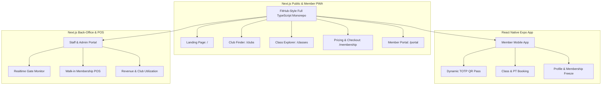

# UI/UX Design System & Information Architecture — Full-Stack TypeScript & Supabase

---

## 1. Brand Identity & Filosofi Visual

### 1.1 Karakter & Visual Direction
Desain platform mengusung tema **High-Energy Athletic Tech**. Tampilan memadukan kesan modern, premium, dan bertenaga tinggi seperti FitHub dengan tata letak minimalis, tipografi tegas (*bold typographic hierarchy*), kontras visual tinggi, dan kemudahan navigasi mobile-first (*frictionless digital fitness experience*).

- **Energetic & Motivating**: Aksen warna *Volt Green* (`#CAFF33`), *Electric Orange* (`#FF5E1E`), dan *Cyan* (`#00E5FF`).
- **Clean & Accessible**: Hirarki informasi bersih, kartu data terstruktur, tanpa dekorasi berlebihan.
- **Full TypeScript Implementation**: Dibangun menggunakan komponen React (Next.js 15) untuk Web & Admin, serta React Native (Expo) untuk Mobile App.

---

## 2. Design Tokens (Sistem Desain)

### 2.1 Palet Warna (Color Palette)

| Kategori Token | Hex Code | Penggunaan |
| :--- | :--- | :--- |
| `--bg-dark` | `#0A0D14` | Latar belakang utama dark mode, navbar, hero section. |
| `--surface-dark` | `#111827` | Permukaan kartu (*cards*), dialog modal, bottom sheet. |
| `--surface-elevated` | `#1A2235` | State kartu saat di-hover, floating controls, input field. |
| `--brand-volt` | `#CAFF33` | Aksen tombol utama (*Primary CTA*), highlight badge, active indicator. |
| `--brand-orange` | `#FF5E1E` | Aksen sekunder, banner promo, label diskon, high-intensity badge. |
| `--brand-cyan` | `#00E5FF` | Akses digital, QR pass glow, live meter indicator. |
| `--text-primary` | `#F8FAFC` | Teks judul utama (*Headings*), teks kontras tinggi. |
| `--text-muted` | `#94A3B8` | Teks deskripsi, keterangan label, sub-header. |
| `--border-subtle` | `rgba(255,255,255,0.07)` | Garis batas kartu, pemisah tabel, divider. |
| `--status-success` | `#10B981` | Check-in berhasil, status active, crowd low. |
| `--status-warning` | `#F59E0B` | Waitlist status, crowd moderate, masa aktif hampir habis. |
| `--status-danger` | `#EF4444` | Check-in ditolak, membership expired, crowd busy. |

### 2.2 Tipografi (Typography Hierarchy)

- **Display & Headings**: `Syne` / `Unbounded` (Tegas, berkarakter atletik, modern).
- **Body & Controls**: `Plus Jakarta Sans` / `Inter` (Tingkat keterbacaan tinggi pada layar mobile).
- **Data & Monospace (Pass, Timer, OTP)**: `JetBrains Mono`.

---

## 3. Information Architecture (IA) & Sitemap



---

## 4. Screen Layout Blueprints & Wireframes

### 4.1 Landing Page Blueprint (Desktop & Mobile)

```
+-------------------------------------------------------------------------------+
| [LOGO] KINETIC        Clubs   Classes   Pricing   PT   Blog    [ Masuk / Join ]|
+-------------------------------------------------------------------------------+
| HERO SECTION                                                                  |
|   [ BADGE: #1 TECH-DRIVEN GYM IN INDONESIA ]                                  |
|   FITNESS MAKIN MUDAH,                                                        |
|   TERJANGKAU & BEBAS RIBET.                                                   |
|   Mulai dari Rp 249rb/bln. Akses 50+ Cabang dengan 1 Dynamic QR Pass.        |
|                                                                               |
|   [ > Join Membership Sekarang ]     [ Cari Cabang Terdekat (GPS) ]           |
|                                                                               |
|   +-------------------+  +-------------------+  +-------------------+         |
|   | 50+ Clubs         |  | 200+ Live Classes |  | 100% Digital Pass |         |
|   | Se-Indonesia      |  | Per Minggu        |  | Tanpa Kartu Fisik |         |
|   +-------------------+  +-------------------+  +-------------------+         |
+-------------------------------------------------------------------------------+
| LIVE CROWD & CLUB LOCATOR TEASER                                              |
|   [ Filter Kota: Jakarta Selatan v ]  [ Opsi: Buka 24 Jam | Free Weights | ..]|
|                                                                               |
|   +------------------------+  +------------------------+                      |
|   | KINETIC - SENOPATI     |  | KINETIC - KUNINGAN     |                      |
|   | * Live Crowd: [LOW]    |  | * Live Crowd: [MODERATE]|                     |
|   | 450m dari lokasi Anda  |  | 1.8km dari lokasi Anda |                      |
|   | Fasilitas: Sauna, Class|  | Fasilitas: Studio, PT  |                      |
|   | [ Lihat Detail Cabang ]|  | [ Lihat Detail Cabang ]|                      |
|   +------------------------+  +------------------------+                      |
+-------------------------------------------------------------------------------+
```

### 4.2 Member Portal — Dynamic QR Pass Screen (Mobile View)

```
+------------------------------------------+
| 09:41                [4G]  [Battery 98%] |
+------------------------------------------+
| [Avatar] Halo, Budi Pratama              |
| Paket: PRO ALL CLUB (Aktif sd 2027)      |
+------------------------------------------+
|                                          |
|         +----------------------+         |
|         |   ACCESS GATE PASS   |         |
|         |   KINETIC SUDIRMAN   |         |
|         |                      |         |
|         |   [######  ######]   |         |
|         |   [##  ##  ##  ##]   |         |
|         |   [######  ######]   |         |
|         |   [   DYNAMIC QR ]   |         |
|         |   [######  ######]   |         |
|         |                      |         |
|         | (O) Refresh dalam 11s|         |
|         +----------------------+         |
|                                          |
|   Status Gerbang: SIAP SCAN MASUK        |
|   * Tunjukkan QR ini ke scanner turnstile|
+------------------------------------------+
| JADWAL SAYA HARI INI                     |
| [18:30] BodyPump - Studio 1 (Confirmed)  |
| Trainer: Sarah Jenkins | [Check-in E-Pass]|
+------------------------------------------+
| [ Home ]  [ Book ]  ( (QR PASS) )  [ Profile ]|
+------------------------------------------+
```

---

## 5. Komponen Kunci & Spesifikasi Micro-Interactions

1. **Dynamic QR Pass Controller**:
   - Di mobile app (React Native), saat membuka layar QR Pass, kecerahan layar HP otomatis dinaikkan ke 100% menggunakan `expo-brightness` dan animasi countdown berputar 15 detik menggunakan `react-native-reanimated`.
2. **Realtime Crowd Meter Badge**:
   - Terkoneksi ke channel Supabase Realtime `supabase.channel('club-crowd').on('postgres_changes', ...)` sehingga persentase kepadatan di kartu cabang berubah seketika tanpa refresh.
3. **Sticky Action Bar**:
   - Di mobile browser (< 768px), tombol *Join Membership* dan *Book Class* menempel di bagian bawah layar untuk konversi checkout maksimal.
