# UI/UX Design System & Information Architecture — KINETIC Platform

---

## 1. Brand Identity & Filosofi Visual

### 1.1 Karakter & Visual Direction
Desain platform mengusung tema **High-Energy Athletic Tech**. Tampilan memadukan kesan modern, premium, dan bertenaga tinggi dengan tata letak minimalis, tipografi tegas (*bold typographic hierarchy*), kontras visual tinggi, dan kemudahan navigasi mobile-first (*frictionless digital fitness experience*).

- **Dual Theme Support**: Mendukung peralihan mulus antara mode gelap agresif (**Obsidian Black**) dan mode terang futuristik (**Titanium Lab Edition**).
- **Energetic & Motivating**: Aksen warna *Volt Green* (`#CAFF33`), *Electric Orange* (`#FF5E1E`), dan *Cyan* (`#00E5FF`).
- **Clean & Accessible**: Hirarki informasi bersih, kartu data terstruktur, tanpa dekorasi berlebihan.
- **Full TypeScript Implementation**: Dibangun menggunakan Next.js 15 App Router, React 19, Tailwind CSS, dan Framer Motion.

---

## 2. Design Tokens (Dual-Theme System)

### 2.1 Palet Tema Gelap (Obsidian Theme — Default)

| Kategori Token | Hex Code | Penggunaan |
| :--- | :--- | :--- |
| `--bg` | `#0A0D14` | Latar belakang utama dark mode, navbar, hero section. |
| `--surface` | `#111827` | Permukaan kartu (*cards*), dialog modal, bottom sheet. |
| `--surface-elevated` | `#1A2235` | State kartu saat di-hover, floating controls, input field. |
| `--brand-volt` | `#CAFF33` | Aksen tombol utama (*Primary CTA*), highlight badge, active indicator. |
| `--brand-orange` | `#FF5E1E` | Aksen sekunder, banner promo, label diskon, high-intensity badge. |
| `--brand-cyan` | `#00E5FF` | Akses digital, QR pass glow, live meter indicator. |
| `--text-primary` | `#F8FAFC` | Teks judul utama (*Headings*), teks kontras tinggi. |
| `--text-muted` | `#94A3B8` | Teks deskripsi, keterangan label, sub-header. |
| `--border` | `rgba(255,255,255,0.07)` | Garis batas kartu, pemisah tabel, divider. |

### 2.2 Palet Tema Terang (Titanium Lab Theme)

| Kategori Token | Hex Code | Penggunaan |
| :--- | :--- | :--- |
| `--bg` | `#F1F5F9` | Latar belakang raw titanium grey, bersih dan berkelas. |
| `--surface` | `#FFFFFF` | Permukaan kartu putih bersih dengan hairline border. |
| `--surface-elevated` | `#E2E8F0` | State kartu elevated & hover controls. |
| `--brand-volt` | `#CAFF33` / `#65A30D` | Aksen volt kontras tinggi pada tombol dan tag. |
| `--brand-cyan` | `#0284C7` | Aksen status digital & telemetri kelas. |
| `--text-primary` | `#0A0D14` | Teks hitam obsidian pekat dengan ketajaman maksimal. |
| `--text-muted` | `#64748B` | Teks keterangan dan deskripsi sekunder. |
| `--border` | `rgba(10,13,20,0.08)` | Garis batas hairline abu-abu netral. |

### 2.3 Tipografi (Typography Hierarchy)

- **Display & Headings**: `Syne` / `Unbounded` (Tegas, berkarakter atletik, modern).
- **Body & Controls**: `Plus Jakarta Sans` / `Inter` (Tingkat keterbacaan tinggi pada layar mobile).
- **Data & Monospace (Pass, Timer, OTP)**: `JetBrains Mono`.

---

## 3. Information Architecture (IA) & Sitemap

```mermaid
graph TD
    Root[KINETIC Next.js 15 Platform]

    subgraph Core App Router Routes
        Root --> Home[Landing Page: /]
        Root --> Clubs[Club Finder 50 Cabang: /clubs]
        Root --> Classes[Class Schedule & Cinema Spot Picker: /classes]
        Root --> Trainers[PT Marketplace & WhatsApp: /trainers]
        Root --> Memberships[Pricing Calculator & Comparison: /membership]
        Root --> Checkout[Multi-Step Checkout & QRIS: /checkout]
        Root --> MemberPortal[Member Dashboard & Dynamic QR Pass: /portal]
        Root --> Onboarding[Athlete Biometric Activation: /onboarding]
    end

    subgraph Admin Command Center
        Root --> AdminOverview[Admin Hub: /admin]
        Root --> AdminGate[Turnstile Simulator: /admin/gate]
        Root --> AdminPOS[Front Desk POS: /admin/pos]
        Root --> AdminAnalytics[Revenue & Traffic: /admin/analytics]
        Root --> AdminClasses[Schedule Manager: /admin/classes]
    end
```

---

## 4. Komponen Kunci UI/UX

1. **Floating Mobile Bottom Navigation (`components/MobileBottomNav.tsx`)**
   * Memberikan pengalaman layaknya aplikasi native iOS/Android saat diakses melalui browser HP (*PWA Native Illusion*).
2. **Cinema-Style Studio Spot Picker (`components/StudioSpotPickerModal.tsx`)**
   * Pemilihan kursi matras/sepeda interaktif berbasis zona (Row A, B, C) dengan ekspor Google Calendar dan iCal (.ics).
3. **Predictive Crowd AI Modal (`components/PredictiveCrowdModal.tsx`)**
   * Visualisasi grafik jam lengang dan rute navigasi cepat Google Maps & Waze.
4. **Interactive 3D Virtual Credit Card (`app/checkout/page.tsx`)**
   * Kartu virtual 3D interaktif yang berputar halus saat member beralih ke input CVV.
