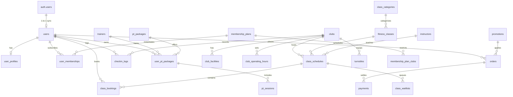

# Database Schema, RLS Policies & Supabase Specification

---

## 1. Database Architecture & Supabase Integration

- **Database Engine**: PostgreSQL 16 (Supabase Managed Engine)
- **Auth Engine**: Supabase Auth (`auth.users`) terintegrasi otomatis dengan `public.users`.
- **Row Level Security (RLS)**: Diaktifkan pada **seluruh tabel publik** untuk keamanan level baris.
- **Realtime Replication**: Diaktifkan untuk tabel publik tertentu guna menyiarkan data ke Next.js & React Native.
- **Extensions**: `uuid-ossp`, `pgcrypto`, `postgis` (untuk geolokasi cabang).

---

## 2. Entity Relationship Diagram (ERD)



---

## 3. Skema DDL Lengkap & Supabase Auth Sync

### 3.1 Domain: Pengguna & Integrasi Supabase Auth

```sql
-- EXTENSIONS
CREATE EXTENSION IF NOT EXISTS "uuid-ossp";
CREATE EXTENSION IF NOT EXISTS "pgcrypto";

-- ENUMS
CREATE TYPE user_role_enum AS ENUM ('MEMBER', 'TRAINER', 'INSTRUCTOR', 'CLUB_STAFF', 'CLUB_MANAGER', 'SUPERADMIN');
CREATE TYPE gender_enum AS ENUM ('MALE', 'FEMALE', 'OTHER');

-- TABLE: public.users (Extends auth.users)
CREATE TABLE public.users (
    id UUID PRIMARY KEY REFERENCES auth.users(id) ON DELETE CASCADE,
    phone_number VARCHAR(20) UNIQUE,
    email VARCHAR(255) UNIQUE,
    full_name VARCHAR(150) NOT NULL,
    role user_role_enum DEFAULT 'MEMBER' NOT NULL,
    avatar_url TEXT,
    referral_code VARCHAR(20) UNIQUE NOT NULL,
    referred_by_id UUID REFERENCES public.users(id) ON DELETE SET NULL,
    created_at TIMESTAMPTZ DEFAULT CURRENT_TIMESTAMP NOT NULL,
    updated_at TIMESTAMPTZ DEFAULT CURRENT_TIMESTAMP NOT NULL
);

-- TABLE: public.user_profiles
CREATE TABLE public.user_profiles (
    id UUID PRIMARY KEY DEFAULT gen_random_uuid(),
    user_id UUID UNIQUE NOT NULL REFERENCES public.users(id) ON DELETE CASCADE,
    gender gender_enum,
    birth_date DATE,
    height_cm NUMERIC(5,2),
    weight_kg NUMERIC(5,2),
    fitness_goal VARCHAR(100),
    emergency_contact_name VARCHAR(150),
    emergency_contact_phone VARCHAR(20),
    created_at TIMESTAMPTZ DEFAULT CURRENT_TIMESTAMP NOT NULL,
    updated_at TIMESTAMPTZ DEFAULT CURRENT_TIMESTAMP NOT NULL
);

-- TABLE: public.user_health_logs
CREATE TABLE public.user_health_logs (
    id UUID PRIMARY KEY DEFAULT gen_random_uuid(),
    user_id UUID NOT NULL REFERENCES public.users(id) ON DELETE CASCADE,
    recorded_at TIMESTAMPTZ DEFAULT CURRENT_TIMESTAMP NOT NULL,
    weight_kg NUMERIC(5,2) NOT NULL,
    body_fat_pct NUMERIC(4,2),
    muscle_mass_kg NUMERIC(5,2),
    bmi NUMERIC(4,2),
    notes TEXT
);

-- AUTOMATIC USER SYNC TRIGGER (Dari auth.users ke public.users)
CREATE OR REPLACE FUNCTION public.handle_new_user()
RETURNS TRIGGER AS $$
DECLARE
    v_ref_code VARCHAR(20);
BEGIN
    -- Generate unique referral code (e.g. KNT-8291A)
    v_ref_code := 'KNT-' || UPPER(SUBSTRING(MD5(NEW.id::text || CURRENT_TIMESTAMP::text) FROM 1 FOR 6));

    INSERT INTO public.users (id, phone_number, email, full_name, role, referral_code)
    VALUES (
        NEW.id,
        NEW.phone,
        NEW.email,
        COALESCE(NEW.raw_user_meta_data->>'full_name', 'Member KINETIC'),
        COALESCE((NEW.raw_user_meta_data->>'role')::user_role_enum, 'MEMBER'),
        v_ref_code
    );

    INSERT INTO public.user_profiles (user_id)
    VALUES (NEW.id);

    RETURN NEW;
END;
$$ LANGUAGE plpgsql SECURITY DEFINER;

CREATE OR REPLACE TRIGGER on_auth_user_created
    AFTER INSERT ON auth.users
    FOR EACH ROW EXECUTE FUNCTION public.handle_new_user();
```

---

### 3.2 Domain: Cabang & Fasilitas (`clubs`, `club_facilities`, `club_operating_hours`, `club_crowd_logs`)

```sql
-- ENUMS
CREATE TYPE crowd_level_enum AS ENUM ('LOW', 'MODERATE', 'BUSY', 'OVERCROWDED');
CREATE TYPE facility_type_enum AS ENUM (
    'SAUNA', 'SHOWER_HOT_WATER', 'SMART_LOCKER', 'FREE_WEIGHT_ZONE', 
    'FUNCTIONAL_AREA', 'STUDIO_PILATES', 'CYCLING_STUDIO', 'PARKING_CAR', 'PARKING_BIKE', 'WATER_STATION'
);

-- TABLE: clubs
CREATE TABLE public.clubs (
    id UUID PRIMARY KEY DEFAULT gen_random_uuid(),
    name VARCHAR(150) NOT NULL,
    slug VARCHAR(150) UNIQUE NOT NULL,
    address TEXT NOT NULL,
    city VARCHAR(100) NOT NULL,
    latitude NUMERIC(10, 7) NOT NULL,
    longitude NUMERIC(10, 7) NOT NULL,
    phone_number VARCHAR(20),
    is_active BOOLEAN DEFAULT TRUE NOT NULL,
    max_capacity INT DEFAULT 150 NOT NULL,
    current_occupancy INT DEFAULT 0 NOT NULL,
    current_crowd_level crowd_level_enum DEFAULT 'LOW' NOT NULL,
    thumbnail_url TEXT,
    gallery_urls JSONB DEFAULT '[]'::jsonb,
    created_at TIMESTAMPTZ DEFAULT CURRENT_TIMESTAMP NOT NULL,
    updated_at TIMESTAMPTZ DEFAULT CURRENT_TIMESTAMP NOT NULL
);

-- TABLE: club_facilities
CREATE TABLE public.club_facilities (
    id UUID PRIMARY KEY DEFAULT gen_random_uuid(),
    club_id UUID NOT NULL REFERENCES public.clubs(id) ON DELETE CASCADE,
    facility_type facility_type_enum NOT NULL,
    display_label VARCHAR(100) NOT NULL,
    icon_name VARCHAR(50),
    UNIQUE(club_id, facility_type)
);

-- TABLE: club_operating_hours
CREATE TABLE public.club_operating_hours (
    id UUID PRIMARY KEY DEFAULT gen_random_uuid(),
    club_id UUID NOT NULL REFERENCES public.clubs(id) ON DELETE CASCADE,
    day_of_week SMALLINT NOT NULL CHECK (day_of_week BETWEEN 1 AND 7),
    open_time TIME NOT NULL,
    close_time TIME NOT NULL,
    is_closed BOOLEAN DEFAULT FALSE NOT NULL,
    UNIQUE(club_id, day_of_week)
);

-- TABLE: club_crowd_logs
CREATE TABLE public.club_crowd_logs (
    id UUID PRIMARY KEY DEFAULT gen_random_uuid(),
    club_id UUID NOT NULL REFERENCES public.clubs(id) ON DELETE CASCADE,
    recorded_at TIMESTAMPTZ DEFAULT CURRENT_TIMESTAMP NOT NULL,
    occupancy_count INT NOT NULL,
    crowd_status crowd_level_enum NOT NULL
);
```

---

### 3.3 Domain: Paket & Keanggotaan (`membership_plans`, `user_memberships`, `membership_freezes`)

```sql
-- ENUMS
CREATE TYPE plan_tier_enum AS ENUM ('SINGLE_CLUB', 'ALL_CLUB', 'DAY_PASS', 'CORPORATE');
CREATE TYPE membership_status_enum AS ENUM (
    'PENDING_PAYMENT', 'ACTIVE', 'FROZEN', 'PAST_DUE', 'SUSPENDED', 'EXPIRED', 'CANCELLED'
);

-- TABLE: membership_plans
CREATE TABLE public.membership_plans (
    id UUID PRIMARY KEY DEFAULT gen_random_uuid(),
    name VARCHAR(150) NOT NULL,
    slug VARCHAR(150) UNIQUE NOT NULL,
    tier plan_tier_enum NOT NULL,
    duration_months INT DEFAULT 1 NOT NULL,
    duration_days INT DEFAULT 30 NOT NULL,
    base_price_idr BIGINT NOT NULL,
    admin_fee_idr BIGINT DEFAULT 0 NOT NULL,
    free_freeze_days INT DEFAULT 0 NOT NULL,
    is_featured BOOLEAN DEFAULT FALSE NOT NULL,
    is_active BOOLEAN DEFAULT TRUE NOT NULL,
    benefits JSONB DEFAULT '[]'::jsonb,
    created_at TIMESTAMPTZ DEFAULT CURRENT_TIMESTAMP NOT NULL,
    updated_at TIMESTAMPTZ DEFAULT CURRENT_TIMESTAMP NOT NULL
);

-- TABLE: membership_plan_clubs
CREATE TABLE public.membership_plan_clubs (
    id UUID PRIMARY KEY DEFAULT gen_random_uuid(),
    plan_id UUID NOT NULL REFERENCES public.membership_plans(id) ON DELETE CASCADE,
    club_id UUID NOT NULL REFERENCES public.clubs(id) ON DELETE CASCADE,
    UNIQUE(plan_id, club_id)
);

-- TABLE: user_memberships
CREATE TABLE public.user_memberships (
    id UUID PRIMARY KEY DEFAULT gen_random_uuid(),
    user_id UUID NOT NULL REFERENCES public.users(id) ON DELETE CASCADE,
    plan_id UUID NOT NULL REFERENCES public.membership_plans(id),
    home_club_id UUID REFERENCES public.clubs(id),
    status membership_status_enum DEFAULT 'PENDING_PAYMENT' NOT NULL,
    start_date DATE NOT NULL,
    end_date DATE NOT NULL,
    auto_renew BOOLEAN DEFAULT TRUE NOT NULL,
    strike_count SMALLINT DEFAULT 0 NOT NULL,
    booking_suspended_until TIMESTAMPTZ,
    total_freeze_days_used INT DEFAULT 0 NOT NULL,
    created_at TIMESTAMPTZ DEFAULT CURRENT_TIMESTAMP NOT NULL,
    updated_at TIMESTAMPTZ DEFAULT CURRENT_TIMESTAMP NOT NULL
);

-- TABLE: membership_freezes
CREATE TABLE public.membership_freezes (
    id UUID PRIMARY KEY DEFAULT gen_random_uuid(),
    user_membership_id UUID NOT NULL REFERENCES public.user_memberships(id) ON DELETE CASCADE,
    freeze_start_date DATE NOT NULL,
    freeze_end_date DATE NOT NULL,
    total_days INT NOT NULL,
    reason TEXT,
    fee_paid_idr BIGINT DEFAULT 0 NOT NULL,
    status VARCHAR(30) DEFAULT 'ACTIVE' NOT NULL,
    created_at TIMESTAMPTZ DEFAULT CURRENT_TIMESTAMP NOT NULL
);
```

---

### 3.4 Domain: Kelas Studio & Booking (`class_categories`, `fitness_classes`, `instructors`, `class_schedules`, `class_bookings`, `class_waitlists`)

```sql
-- ENUMS
CREATE TYPE intensity_level_enum AS ENUM ('BEGINNER', 'INTERMEDIATE', 'ADVANCED', 'ALL_LEVELS');
CREATE TYPE schedule_status_enum AS ENUM ('SCHEDULED', 'ONGOING', 'COMPLETED', 'CANCELLED');
CREATE TYPE booking_status_enum AS ENUM ('CONFIRMED', 'CANCELLED_ON_TIME', 'LATE_CANCELLED', 'ATTENDED', 'NO_SHOW');
CREATE TYPE waitlist_status_enum AS ENUM ('QUEUED', 'PROMOTED', 'EXPIRED', 'CANCELLED');

-- TABLE: class_categories
CREATE TABLE public.class_categories (
    id UUID PRIMARY KEY DEFAULT gen_random_uuid(),
    name VARCHAR(100) NOT NULL,
    slug VARCHAR(100) UNIQUE NOT NULL,
    description TEXT,
    badge_color VARCHAR(20) DEFAULT '#CAFF33'
);

-- TABLE: fitness_classes
CREATE TABLE public.fitness_classes (
    id UUID PRIMARY KEY DEFAULT gen_random_uuid(),
    category_id UUID NOT NULL REFERENCES public.class_categories(id),
    name VARCHAR(150) NOT NULL,
    slug VARCHAR(150) UNIQUE NOT NULL,
    description TEXT,
    intensity intensity_level_enum DEFAULT 'ALL_LEVELS' NOT NULL,
    duration_minutes INT DEFAULT 50 NOT NULL,
    estimated_calories_burn INT DEFAULT 450,
    cover_image_url TEXT,
    is_active BOOLEAN DEFAULT TRUE NOT NULL
);

-- TABLE: instructors
CREATE TABLE public.instructors (
    id UUID PRIMARY KEY DEFAULT gen_random_uuid(),
    user_id UUID REFERENCES public.users(id) ON DELETE SET NULL,
    full_name VARCHAR(150) NOT NULL,
    bio TEXT,
    photo_url TEXT,
    specializations JSONB DEFAULT '[]'::jsonb,
    instagram_handle VARCHAR(100),
    rating_avg NUMERIC(3, 2) DEFAULT 5.0 NOT NULL,
    rating_count INT DEFAULT 0 NOT NULL,
    is_active BOOLEAN DEFAULT TRUE NOT NULL
);

-- TABLE: class_schedules
CREATE TABLE public.class_schedules (
    id UUID PRIMARY KEY DEFAULT gen_random_uuid(),
    fitness_class_id UUID NOT NULL REFERENCES public.fitness_classes(id),
    club_id UUID NOT NULL REFERENCES public.clubs(id) ON DELETE CASCADE,
    instructor_id UUID NOT NULL REFERENCES public.instructors(id),
    studio_room_name VARCHAR(100) DEFAULT 'Studio 1',
    start_time TIMESTAMPTZ NOT NULL,
    end_time TIMESTAMPTZ NOT NULL,
    max_capacity INT DEFAULT 30 NOT NULL,
    booked_count INT DEFAULT 0 NOT NULL,
    status schedule_status_enum DEFAULT 'SCHEDULED' NOT NULL,
    created_at TIMESTAMPTZ DEFAULT CURRENT_TIMESTAMP NOT NULL,
    updated_at TIMESTAMPTZ DEFAULT CURRENT_TIMESTAMP NOT NULL
);

-- TABLE: class_bookings
CREATE TABLE public.class_bookings (
    id UUID PRIMARY KEY DEFAULT gen_random_uuid(),
    schedule_id UUID NOT NULL REFERENCES public.class_schedules(id) ON DELETE CASCADE,
    user_id UUID NOT NULL REFERENCES public.users(id) ON DELETE CASCADE,
    status booking_status_enum DEFAULT 'CONFIRMED' NOT NULL,
    seat_number INT,
    booked_at TIMESTAMPTZ DEFAULT CURRENT_TIMESTAMP NOT NULL,
    cancelled_at TIMESTAMPTZ,
    checked_in_at TIMESTAMPTZ,
    strike_applied BOOLEAN DEFAULT FALSE NOT NULL,
    UNIQUE(schedule_id, user_id)
);

-- TABLE: class_waitlists
CREATE TABLE public.class_waitlists (
    id UUID PRIMARY KEY DEFAULT gen_random_uuid(),
    schedule_id UUID NOT NULL REFERENCES public.class_schedules(id) ON DELETE CASCADE,
    user_id UUID NOT NULL REFERENCES public.users(id) ON DELETE CASCADE,
    position_number INT NOT NULL,
    status waitlist_status_enum DEFAULT 'QUEUED' NOT NULL,
    created_at TIMESTAMPTZ DEFAULT CURRENT_TIMESTAMP NOT NULL,
    promoted_at TIMESTAMPTZ,
    UNIQUE(schedule_id, user_id)
);
```

---

### 3.5 Domain: IoT Turnstile & Check-in (`turnstiles`, `checkin_logs`)

```sql
CREATE TYPE gate_type_enum AS ENUM ('ENTRY_TRIPOD', 'EXIT_TRIPOD', 'FLAP_BARRIER');
CREATE TYPE check_action_enum AS ENUM ('CHECK_IN', 'CHECK_OUT');
CREATE TYPE check_status_enum AS ENUM ('GRANTED', 'DENIED');

CREATE TABLE public.turnstiles (
    id UUID PRIMARY KEY DEFAULT gen_random_uuid(),
    club_id UUID NOT NULL REFERENCES public.clubs(id) ON DELETE CASCADE,
    device_code VARCHAR(50) UNIQUE NOT NULL,
    device_name VARCHAR(100) NOT NULL,
    gate_type gate_type_enum DEFAULT 'ENTRY_TRIPOD' NOT NULL,
    ip_address INET,
    is_online BOOLEAN DEFAULT TRUE NOT NULL,
    last_heartbeat_at TIMESTAMPTZ,
    created_at TIMESTAMPTZ DEFAULT CURRENT_TIMESTAMP NOT NULL
);

CREATE TABLE public.checkin_logs (
    id UUID PRIMARY KEY DEFAULT gen_random_uuid(),
    user_id UUID NOT NULL REFERENCES public.users(id) ON DELETE CASCADE,
    club_id UUID NOT NULL REFERENCES public.clubs(id) ON DELETE CASCADE,
    turnstile_id UUID REFERENCES public.turnstiles(id) ON DELETE SET NULL,
    action check_action_enum NOT NULL,
    status check_status_enum NOT NULL,
    verification_method VARCHAR(30) DEFAULT 'DYNAMIC_QR' NOT NULL,
    failure_reason VARCHAR(100),
    created_at TIMESTAMPTZ DEFAULT CURRENT_TIMESTAMP NOT NULL
);
```

---

### 3.6 Domain: Finansial & Pembayaran (`orders`, `payments`, `promotions`)

```sql
CREATE TYPE order_status_enum AS ENUM ('PENDING', 'PAID', 'EXPIRED', 'FAILED', 'REFUNDED');
CREATE TYPE item_type_enum AS ENUM ('MEMBERSHIP_PLAN', 'PT_PACKAGE', 'DAY_PASS', 'FREEZE_FEE');

CREATE TABLE public.orders (
    id UUID PRIMARY KEY DEFAULT gen_random_uuid(),
    order_number VARCHAR(50) UNIQUE NOT NULL,
    user_id UUID NOT NULL REFERENCES public.users(id) ON DELETE CASCADE,
    item_type item_type_enum NOT NULL,
    item_id UUID NOT NULL,
    gross_amount_idr BIGINT NOT NULL,
    discount_amount_idr BIGINT DEFAULT 0 NOT NULL,
    net_amount_idr BIGINT NOT NULL,
    status order_status_enum DEFAULT 'PENDING' NOT NULL,
    idempotency_key VARCHAR(100) UNIQUE,
    created_at TIMESTAMPTZ DEFAULT CURRENT_TIMESTAMP NOT NULL,
    updated_at TIMESTAMPTZ DEFAULT CURRENT_TIMESTAMP NOT NULL
);

CREATE TABLE public.payments (
    id UUID PRIMARY KEY DEFAULT gen_random_uuid(),
    order_id UUID NOT NULL REFERENCES public.orders(id) ON DELETE CASCADE,
    gateway_provider VARCHAR(50) NOT NULL, -- XENDIT, MIDTRANS
    gateway_reference_id VARCHAR(100),
    payment_method VARCHAR(50) NOT NULL, -- QRIS, BCA_VA, GOPAY, CC
    amount_idr BIGINT NOT NULL,
    status VARCHAR(30) DEFAULT 'PENDING' NOT NULL,
    paid_at TIMESTAMPTZ,
    raw_response JSONB,
    created_at TIMESTAMPTZ DEFAULT CURRENT_TIMESTAMP NOT NULL
);

CREATE TABLE public.promotions (
    id UUID PRIMARY KEY DEFAULT gen_random_uuid(),
    code VARCHAR(50) UNIQUE NOT NULL,
    description TEXT,
    discount_type VARCHAR(20) NOT NULL,
    discount_value BIGINT NOT NULL,
    min_order_idr BIGINT DEFAULT 0 NOT NULL,
    max_discount_idr BIGINT,
    quota_total INT DEFAULT 100 NOT NULL,
    quota_used INT DEFAULT 0 NOT NULL,
    valid_from TIMESTAMPTZ NOT NULL,
    valid_until TIMESTAMPTZ NOT NULL,
    is_active BOOLEAN DEFAULT TRUE NOT NULL
);
```

---

## 4. Row Level Security (RLS) Policies

```sql
-- 1. AKTIFKAN RLS PADA SEMUA TABEL
ALTER TABLE public.users ENABLE ROW LEVEL SECURITY;
ALTER TABLE public.user_profiles ENABLE ROW LEVEL SECURITY;
ALTER TABLE public.user_memberships ENABLE ROW LEVEL SECURITY;
ALTER TABLE public.class_bookings ENABLE ROW LEVEL SECURITY;
ALTER TABLE public.checkin_logs ENABLE ROW LEVEL SECURITY;
ALTER TABLE public.orders ENABLE ROW LEVEL SECURITY;
ALTER TABLE public.payments ENABLE ROW LEVEL SECURITY;
ALTER TABLE public.clubs ENABLE ROW LEVEL SECURITY;
ALTER TABLE public.class_schedules ENABLE ROW LEVEL SECURITY;
ALTER TABLE public.membership_plans ENABLE ROW LEVEL SECURITY;

-- 2. PUBLIC READ POLICIES (Bisa dibaca publik tanpa login)
CREATE POLICY "Public can view active clubs" ON public.clubs 
    FOR SELECT USING (is_active = TRUE);

CREATE POLICY "Public can view active membership plans" ON public.membership_plans 
    FOR SELECT USING (is_active = TRUE);

CREATE POLICY "Public can view class schedules" ON public.class_schedules 
    FOR SELECT USING (status != 'CANCELLED');

-- 3. USER SELF ACCESS POLICIES (Hanya bisa akses data diri sendiri)
CREATE POLICY "Users can view and update own profile" ON public.users 
    FOR ALL USING (auth.uid() = id);

CREATE POLICY "Users can view and edit own user_profiles" ON public.user_profiles 
    FOR ALL USING (auth.uid() = user_id);

CREATE POLICY "Users can view own memberships" ON public.user_memberships 
    FOR SELECT USING (auth.uid() = user_id);

CREATE POLICY "Users can view and manage own class bookings" ON public.class_bookings 
    FOR ALL USING (auth.uid() = user_id);

CREATE POLICY "Users can view own orders and payments" ON public.orders 
    FOR SELECT USING (auth.uid() = user_id);

CREATE POLICY "Users can view own checkin logs" ON public.checkin_logs 
    FOR SELECT USING (auth.uid() = user_id);

-- 4. SERVICE ROLE & ADMIN BYPASS
-- Supabase Edge Functions menggunakan service_role key yang otomatis membypass RLS untuk mutasi pembayaran & scan gerbang IoT.
```

---

## 5. PostgreSQL Stored Procedures (RPC)

### 5.1 Atomic Class Booking (`book_class_atomic`)
Mencegah *race condition* / *double booking* di level database dengan transaksi atomik dan *Row Lock*.

```sql
CREATE OR REPLACE FUNCTION public.book_class_atomic(
    p_schedule_id UUID,
    p_seat_number INT DEFAULT NULL
)
RETURNS JSONB
LANGUAGE plpgsql
SECURITY DEFINER
AS $$
DECLARE
    v_user_id UUID;
    v_schedule RECORD;
    v_active_membership RECORD;
    v_booking_id UUID;
BEGIN
    v_user_id := auth.uid();
    IF v_user_id IS NULL THEN
        RAISE EXCEPTION 'Unauthorized. Please login.' USING ERRCODE = '40100';
    END IF;

    -- 1. Cek keanggotaan aktif
    SELECT * INTO v_active_membership FROM public.user_memberships 
    WHERE user_id = v_user_id AND status = 'ACTIVE' AND end_date >= CURRENT_DATE
    LIMIT 1;

    IF v_active_membership IS NULL THEN
        RETURN jsonb_build_object('success', false, 'errorCode', 'NO_ACTIVE_MEMBERSHIP', 'message', 'Keanggotaan aktif tidak ditemukan.');
    END IF;

    -- 2. Cek apakah ada suspensi penalti
    IF v_active_membership.booking_suspended_until IS NOT NULL AND v_active_membership.booking_suspended_until > CURRENT_TIMESTAMP THEN
        RETURN jsonb_build_object('success', false, 'errorCode', 'BOOKING_SUSPENDED', 'message', 'Akun sedang disanksi penalti pembatalan.');
    END IF;

    -- 3. Lock baris schedule untuk mencegah race condition (FOR UPDATE)
    SELECT * INTO v_schedule FROM public.class_schedules 
    WHERE id = p_schedule_id AND status = 'SCHEDULED' 
    FOR UPDATE;

    IF v_schedule IS NULL THEN
        RETURN jsonb_build_object('success', false, 'errorCode', 'SCHEDULE_NOT_FOUND', 'message', 'Jadwal kelas tidak ditemukan.');
    END IF;

    -- 4. Cek apakah sudah pernah booking kelas ini
    IF EXISTS (SELECT 1 FROM public.class_bookings WHERE schedule_id = p_schedule_id AND user_id = v_user_id AND status = 'CONFIRMED') THEN
        RETURN jsonb_build_object('success', false, 'errorCode', 'ALREADY_BOOKED', 'message', 'Anda sudah memesan kursi di kelas ini.');
    END IF;

    -- 5. Cek kuota
    IF v_schedule.booked_count >= v_schedule.max_capacity THEN
        RETURN jsonb_build_object('success', false, 'errorCode', 'CLASS_FULL', 'message', 'Kelas sudah penuh. Silakan bergabung ke Waitlist.');
    END IF;

    -- 6. Insert booking dan increment booked_count
    INSERT INTO public.class_bookings (schedule_id, user_id, seat_number, status)
    VALUES (p_schedule_id, v_user_id, p_seat_number, 'CONFIRMED')
    RETURNING id INTO v_booking_id;

    UPDATE public.class_schedules 
    SET booked_count = booked_count + 1, updated_at = CURRENT_TIMESTAMP
    WHERE id = p_schedule_id;

    RETURN jsonb_build_object(
        'success', true, 
        'message', 'Booking berhasil terkonfirmasi.',
        'bookingId', v_booking_id,
        'scheduleId', p_schedule_id
    );
END;
$$;
```

---

## 6. Supabase Realtime Publication

```sql
-- Tambahkan tabel publik ke publikasi Realtime Supabase
ALTER PUBLICATION supabase_realtime ADD TABLE public.club_crowd_logs;
ALTER PUBLICATION supabase_realtime ADD TABLE public.class_schedules;
ALTER PUBLICATION supabase_realtime ADD TABLE public.checkin_logs;
```
